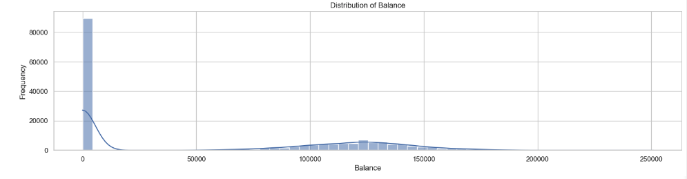
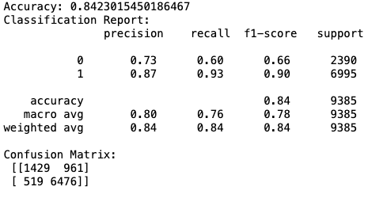

# AISD-interviewAssignment
---

## 項目概述

此項目是一個機器學習應用，旨在使用 XGBoost 分類器預測銀行客戶的流失（Exited）情況。項目通過預處理數據、處理類別不平衡、訓練 XGBoost 模型，並在測試數據上應用模型來生成流失預測。

## 安裝指南

在開始之前，您需要安裝 Python 和以下依賴庫：

- pandas
- numpy
- scikit-learn
- xgboost
- matplotlib
- seaborn

您可以使用 pip 安裝這些依賴：

```bash
pip install pandas numpy scikit-learn xgboost matplotlib seaborn
```

## 文件結構

- `train.csv` - 訓練數據集文件，包含客戶信息和他們是否流失的標籤。
- `test.csv` - 測試數據集文件，包含客戶信息，不包含流失標籤。
- `main.py` - 主腳本文件，包含數據預處理、模型訓練和評估等所有步驟。
- `README.md` - 說明文件，提供項目概述、安裝指南和使用方法。

## 使用方法

1. 確保所有數據文件（`train.csv` 和 `test.csv`）位於腳本相同的目錄下。
2. 在命令行中運行以下命令來執行腳本：

```bash
python main.py
```

運行後，腳本將處理數據、訓練模型並對測試數據進行預測，結果將保存在名為 `predictions.csv` 的新文件中。

## 功能描述

- **數據預處理**：包括刪除無關特徵、編碼分類變量、轉換數據類型以及特徵縮放。
- **處理類別不平衡**：使用隨機下採樣技術平衡數據集中的類別，這有助於提高模型對少數類的識別能力，從而提高整體預測精度和模型的實用價值。
- **模型訓練與評估**：使用 XGBoost 進行分類，並提供詳盡的模型評估報告，包括準確率、精確率、召回率和 F1 分數。
- **預測與結果輸出**：對測試數據進行預測，輸出包含預測結果的 CSV 文件。

---

為了在您的 README.md 文件中更全面解釋為什麼選擇使用 XGBoost 作為預測模型，您可以在功能描述部分添加以下段落：

---

# 為什麼選擇 XGBoost

在眾多機器學習算法中，我們選擇 XGBoost（eXtreme Gradient Boosting）作為預測模型的核心，主要基於以下幾個理由：

- **高效性能**：XGBoost 是一種基於樹的學習算法，它利用梯度提升框架，能夠在保證學習精度的同時，提供快速的執行效率。
- **模型穩健性**：XGBoost 內置了多種正則化技術，能有效減少模型過擬合，提高模型的泛化能力，這對於我們數據集中的不平衡類別特別重要。
- **靈活調整能力**：XGBoost 支持用戶對學習目標和評估準則進行自定義，提供了豐富的參數設置來調整模型行為，以適應不同的數據特性和需求。
- **處理缺失值**：XGBoost 可以自動處理數據中的缺失值，這對於實際應用中經常遇到的不完整數據集尤其有用。
- **良好的社區支持**：XGBoost 擁有活躍的開發和用戶社區，提供了大量的教程和實踐指南，這有助於解決實際應用中的問題。

---

## 數據不平衡處理與模型調適挑戰

在本項目中，面對客戶數據極度不平衡的問題，採用了多種策略來嘗試提高對流失客戶（Exited = 1）的預測準確性。儘管進行了以下調整，預測性能的提升並不如預期：

### 超參數優化和類別權重調整
- **超參數優化**：透過網格搜索和隨機搜索尋找最優的模型參數，期望透過精確的參數設定來提升模型表現。
- **Scale_pos_weight 調整**：嘗試透過 `scale_pos_weight` 參數調整正負樣本權重，使模型對少數類的預測更為敏感。
- **SMOTE 方法**：實施了合成少數類過採樣技術 (SMOTE)，以增加少數類樣本數量，但結果顯示準確率提升有限。

### 隨機欠採樣的實施
由於以上方法提升不明顯，最終選擇對多數類進行隨機欠採樣，降低其在數據集中的比例，以達到類別平衡。這種方法簡單直接，有助於減輕模型對多數類的偏好，從而使得對少數類的預測更為準確。

### 特徵增強的需求
儘管進行了多種數據平衡技術的試驗，我們認為模型的準確度仍有提升空間。未來，如果能從原始數據中提取或添加更多與客戶流失直接相關的特徵，將可能顯著提高預測的準確性。我們期望透過進一步的數據探索和特徵工程，來發現新的有價值的預測信號。

---




從餘額分佈圖來看，大量客戶的餘額為0，這可能表示特定的客戶行為或銀行賬戶狀態。將「Balance」特徵轉換為二元（0和1）的形式，是基於以下幾個原因：

### 1. 數據稀疏性
大量的賬戶餘額為0可能指示非活躍賬戶或者新開設的賬戶。這樣的稀疏性對於許多機器學習模型來說可能是個問題，因為模型可能難以從這些數據中學習到有用信息。

### 2. 特徵的預測力
將「Balance」進行二元轉換後，可以直接將「無餘額」（即餘額為0）與「有餘額」的客戶區分開來，這可以是一個強預測因子。在實際應用中，無餘額的客戶可能更有可能流失，因為他們與銀行的財務綁定較少。

### 3. 模型複雜度
通過簡化這個特徵，我們減少了模型需要處理的連續數據的複雜度，從而可能提高模型的運行效率和預測的穩定性。

### 4. 增強模型解釋性
二元特徵在某些情況下可以提供更好的解釋性。例如，在決策樹模型中，「是否有餘額」可以直接用於分支決策，清晰顯示這一屬性對於預測結果的重要性。

### 5. 數據前處理的一致性
如果數據集中其他類似的特徵也進行了類似的處理，這樣的一致性處理有助於保持模型處理數據的方式的一致性，避免因數據類型的不一致而導致的預測偏差。


## 模型評估結果

以下是模型在測試數據集上的性能表現，包括精準度（Precision）、召回率（Recall）、F1分數，以及支持數量（Support，即每個類別的樣本數）。


### 分類報告
- **類別 0（未流失）**：
  - 精準度：0.73
  - 召回率：0.60
  - F1分數：0.66
  - 支持數量：2390

- **類別 1（流失）**：
  - 精準度：0.87
  - 召回率：0.93
  - F1分數：0.90
  - 支持數量：6995

整體模型的準確率為 0.8423，表明模型在識別潛在流失客戶方面具有較高的準確性和可靠性。

### 混淆矩陣
混淆矩陣顯示了模型預測的真實情況與實際情況的對比：
- **真陰性（TN）：1429** - 模型正確預測的非流失客戶數量。
- **偽陽性（FP）：961** - 模型錯誤預測為流失的非流失客戶數量。
- **偽陰性（FN）：519** - 模型錯誤預測為非流失的流失客戶數量。
- **真陽性（TP）：6476** - 模型正確預測的流失客戶數量。

此混淆矩陣有助於進一步了解模型在預測客戶流失方面的表現，特別是模型如何平衡錯誤的正面和負面預測。


# 結論
## 重視流失客戶預測的原因與影響

在銀行業務和其他許多服務行業中，客戶流失率的管理對於企業的長期成功至關重要。有效預測哪些客戶可能流失，並採取措施留住他們，可以帶來以下幾個顯著的商業和社會效益：

### 提高客戶留存率
- **成本效益**：獲得新客戶的成本遠高於保持現有客戶。通過準確識別即將流失的客戶，企業可以針對性地對這些客戶實施留存策略，從而降低總體營銷支出。
- **增加收入**：保持客戶忠誠度和長期交易關係可以穩定收入來源，提高生命週期價值。忠實客戶更可能購買更多產品或服務，並推薦新客戶。

### 優化資源分配
- **客戶服務改善**：了解客戶流失的可能原因使企業能夠改進產品或服務，進而提升客戶滿意度和整體體驗。
- **精準營銷**：對即將流失的客戶進行精準營銷，不僅提高了營銷活動的有效性，還可以更合理地分配營銷資源。


因此，特別關注提高對流失客戶（Exited = 1）預測的準確率。透過精確的流失預測和有效的客戶留存策略，企業能夠在競爭激烈的市場環境中保持競爭力，同時為消費者提供更優質的服務。

---
